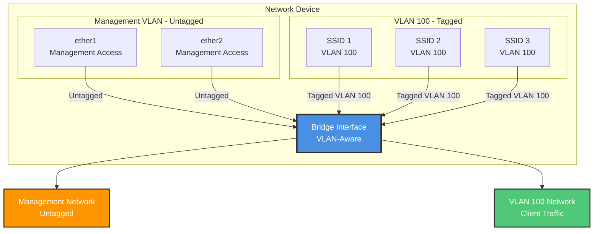

# Network Configuration as Code - MikroTik

[](https://github.com/NickBorgers/mikrotik-as-wap-configurator/pkgs/container/mikrotik-as-wap-configurator)
[](https://opensource.org/licenses/MIT)

YAML-based configuration management for MikroTik network devices with safe, repeatable deployments.

## Network Topology



## Quick Start

> **New to this?** See [GETTING-STARTED.md](GETTING-STARTED.md) for detailed first-time setup instructions.

### Docker (Recommended)

```bash
# Get example configuration
docker run ghcr.io/nickborgers/mikrotik-as-wap-configurator example > config.yaml

# Edit config.yaml with your settings, then apply
docker run -v $(pwd)/config.yaml:/config/config.yaml \
  ghcr.io/nickborgers/mikrotik-as-wap-configurator apply
```

See [DOCKER.md](DOCKER.md) for complete Docker documentation.

### Node.js Installation

**Prerequisites:**
- Node.js (LTS version)
- SSH access to MikroTik device via Ethernet
- MikroTik RouterOS v7+ (with WiFi package)

⚠️ **Important**: Management must be performed over Ethernet (ether1/ether2). Do not manage the device via WiFi as the script reconfigures all WiFi interfaces.

```bash
npm install
```

### Configure a Device (Fresh or Existing)

1. Create your configuration file:

```bash
cp config.example.yaml my-device.yaml
```

2. Edit the configuration:

```yaml
device:
  host: 192.168.88.1
  username: admin
  password: your-password

managementInterfaces:
  - ether1
  - ether2

ssids:
  # SSID on both bands (most common)
  - ssid: MyNetwork
    passphrase: your-wifi-password
    vlan: 100
    bands:
      - 2.4GHz
      - 5GHz

  # Guest network on different VLAN
  - ssid: Guest-WiFi
    passphrase: guest-password
    vlan: 200
    bands:
      - 2.4GHz
      - 5GHz
```

3. Apply the configuration:

```bash
./apply-config.js my-device.yaml
```

**This same command works for:**
- ✅ Fresh out-of-box devices
- ✅ Updating existing configurations
- ✅ Adding/changing SSIDs
- ✅ Changing passwords

The script is **idempotent** and safe to run multiple times.

## Configuration File Format

```yaml
# Device connection
device:
  host: <ip-address>
  username: admin
  password: <password>

# Management interfaces (untagged traffic)
managementInterfaces:
  - ether1
  - ether2

# SSIDs - Band-based configuration
ssids:
  - ssid: <broadcast-name>
    passphrase: <wpa2-password>
    vlan: <vlan-id>
    bands:
      - 2.4GHz    # Broadcast on 2.4GHz band (wifi1)
      - 5GHz      # Broadcast on 5GHz band (wifi2)
      # You can specify one or both bands
```

### Band Configuration

Each SSID can specify which bands it should broadcast on:

- **Both bands** (typical): `bands: [2.4GHz, 5GHz]` - Same SSID on both radios
- **2.4GHz only**: `bands: [2.4GHz]` - Better range, slower speed
- **5GHz only**: `bands: [5GHz]` - Shorter range, faster speed

The same SSID name can be used on both bands, providing seamless roaming for clients.

## How It Works

### Safe Configuration Approach

This system uses a **VLAN filtering disabled** approach to prevent lockouts while still achieving network isolation:

1. **WiFi VLAN Isolation**: Achieved through WiFi datapaths, not bridge VLAN filtering
2. **Management Access**: Always preserved on bridge interface
3. **No Lockout Risk**: VLAN filtering disabled = device always accessible
4. **Layer 2 Isolation**: WiFi clients isolated via datapath VLAN tagging

### MikroTik RouterOS v7 WiFi Configuration

In RouterOS v7, WiFi is configured directly on interfaces using inline properties:

```javascript
// Correct syntax for RouterOS v7
/interface/wifi set wifi1
  configuration.ssid=SSID-1
  security.authentication-types=wpa2-psk
  security.passphrase=password
  datapath.vlan-id=100
```

## Scripts

| Script | Purpose |
|--------|---------|
| `apply-config.js` | Apply YAML configuration to device |
| `configure-device.sh` | Automated configuration with password update |
| `wait-for-device.js` | Wait for device to be ready |

## Usage Examples

### Configure Single Device

```bash
./apply-config.js config.yaml
```

### Configure Different IP

```bash
./apply-config.js config.yaml 192.168.1.100
```

### Automated Configuration

```bash
./configure-device.sh <password> [config-file]
```

### Batch Configuration

```bash
for ip in 192.168.1.{10..20}; do
  ./apply-config.js config.yaml $ip
done
```

## Network Configuration

### Management VLAN (Untagged)
- **ether1, ether2**: Bridge members, untagged
- Provides administrative access to device
- Bridge IP remains accessible

### Client VLAN (VLAN 100)
- **WiFi SSIDs**: All configured on VLAN 100 via datapaths
- Client traffic isolated from management
- All SSIDs share same broadcast domain

### Bridge Configuration
- VLAN filtering: **DISABLED** (safe mode)
- Management access: Always available
- WiFi isolation: Via datapaths

## Troubleshooting

### Device Not Accessible

Check both management IP and bridge IP:
```bash
ssh admin@<management-ip>
ssh admin@192.168.88.1
```

### WiFi Not Broadcasting

Verify WiFi configuration:
```bash
ssh admin@<device-ip>
/interface/wifi print
```

Reconfigure if needed:
```bash
./apply-config.js config.yaml
```

### Reset to Defaults

Factory reset the device and reapply configuration:
```bash
./configure-device.sh <password> config.yaml
```

## Security Considerations

- **Management via Ethernet only**: This tool assumes device management is performed over Ethernet (ether1/ether2), not WiFi. WiFi configurations may be removed/reconfigured during script execution.
- Change default passwords before deployment
- Use strong WPA2 passphrases (12+ characters minimum)
- Keep configuration files secure (contain credentials)
- Consider environment variables for sensitive data
- Regularly update RouterOS firmware

## Advanced: VLAN Filtering

This configuration uses **VLAN filtering disabled** for safety. To enable full VLAN filtering with proper isolation:

1. Management VLAN interface must be created first
2. Management IP must be moved to VLAN interface
3. Bridge VLAN table must include management VLAN
4. Enable VLAN filtering as final step

⚠️ **Warning**: Improper VLAN filtering configuration will cause immediate lockout. Only attempt if you understand MikroTik VLAN filtering and have console access.

## Project Structure

```
network-config-as-code/
├── apply-config.js              # Main configuration script
├── mikrotik-no-vlan-filtering.js # Core configuration library
├── config.yaml                  # Device configuration
├── config.example.yaml          # Example configuration
├── configure-device.sh          # Automated setup script
├── wait-for-device.js           # Device availability checker
├── README.md                    # This file
├── GETTING-STARTED.md           # First-time setup guide
├── CHANGELOG.md                 # Version history
└── LICENSE                      # MIT License
```

## License

MIT - See [LICENSE](LICENSE) file for details
